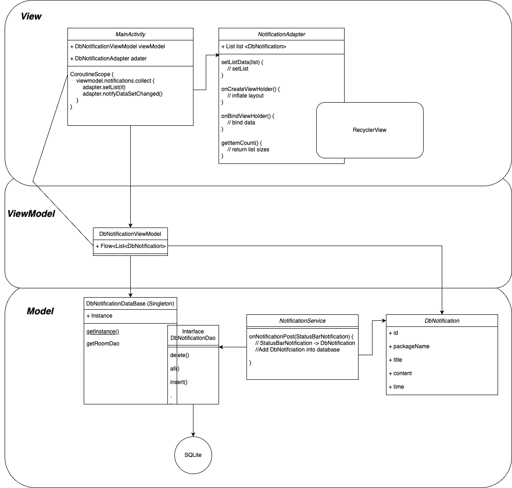

# SmartNotifcation [MVVM / Room / coroutine / RecyclerView]

- This app use a background service to get the system notifications, collecting package name, title, content and post time from notifications.
- Use MVVM to separate data presentation logic from business logic by moving it into particular class for a clear distinction .
 
 

#Demo
<table>
    <thead>
        <tr>
            <th>Pic</th>
            <th>Discription</th>
        </tr>
    </thead>    
    <tbody>
        <tr>
            <td></td>
            <td>A dialog for requesting the permission to access the system notification.</td>
       </tr>       
        <tr>
            <td></td>
            <td>Navigate to the permission settings page.</td>
        </tr>        
        <tr>
            <td></td>
            <td>Show permissions.</td>
        </tr>
        <tr>
            <td></td>
            <td>Delete notification from database.</td>
        </tr>
        <tr>
            <td></td>
            <td>Delete all.</td>
        </tr>                
    </tbody> 
</table>

## Structure

